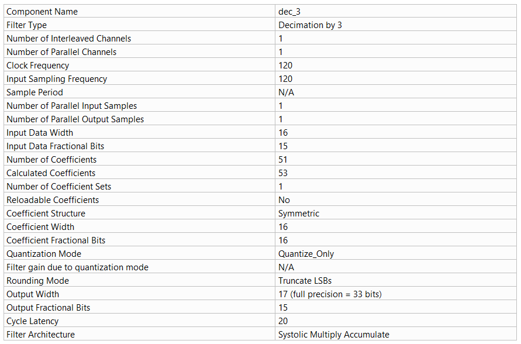
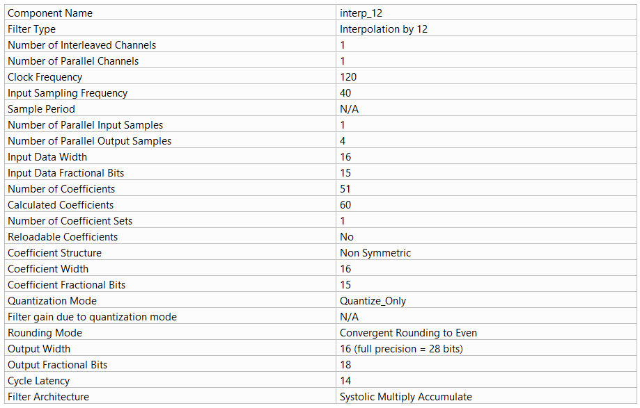

# Multirate DSP Core – Decimation by 3 + Interpolation by 12 (Verilog)

**Technical assessment submission for ApexPlus Technologies**

This repository implements and verifies a complete multirate DSP signal-processing chain using **Xilinx FIR Compiler IP cores** and custom Verilog HDL.  
The design performs **decimation by 3** followed by **interpolation by 12**, converting a 120 MHz input stream into a 480 MHz output stream while preserving signal integrity in fixed-point arithmetic.

---

## System Overview

| Stage              | Rate Change | Sampling Frequency | Data Format          |
|--------------------|-------------|--------------------|----------------------|
| Input              | –           | 120 MHz            | 16-bit Q1.15        |
| FIR Decimator      | ÷ 3         | 40 MHz             | 24-bit intermediate |
| Format Conversion  | –           | 40 MHz             | 16-bit Q1.15        |
| FIR Interpolator   | × 12        | 480 MHz            | 64-bit packed (4×16-bit) |
| Final Output       | –           | 480 MHz            | 4 × 16-bit Q1.15    |

**Overall rate conversion factor**: 12 / 3 = **4×**

### Architecture Diagram

```text
                Input Signal
                 120 MHz
                (Q1.15)
                    │
                    ▼
            ┌────────────────┐
            │  FIR Decimator │  ÷ 3
            │   (51-tap LPF) │
            └───────┬────────┘
                    │
                  40 MHz
                    │
                    ▼
            ┌────────────────┐
            │ Format Convert │  24-bit → 16-bit Q1.15
            └───────┬────────┘
                    │
                    ▼
            ┌────────────────┐
            │ FIR Interpolator│  × 12
            │  (51-tap LPF)  │
            └───────┬────────┘
                    │
                 480 MHz
              (4× parallel samples)
                    │
                    ▼
              Final Output
           (packed 64-bit Q1.15)
```
## Key Features

1. Xilinx FIR Compiler polyphase decimator (factor 3) and interpolator (factor 12)
2. AXI4-Stream interfaces throughout
3. Fixed-point arithmetic with careful Q-format management
4. 51-tap low-pass FIR filters (Hamming window design)
5. Complete testbench with file-based stimulus and result capture
6. MATLAB-based frequency-domain verification (FFT analysis)
7. Simulation results and plots included

## Filter Specifications
## Decimator (dec_3)

## Interpolator (interp_12)


## Fixed-Point Handling
